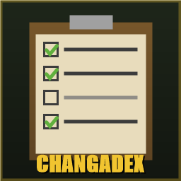

# Changadex

An item collection tracker for **Project Zomboid (Build 42)** — a
Pokédex-style codex for everything you can find in Knox County. Items get
added to your personal log as they pass through your inventory, or you
can mark them manually from the right-click menu.

## Features

- **Collection window** with a category sidebar (Weapons, Food, Clothing,
  Literature, Entertainment, Tools, ...) and a per-category progress bar,
  plus a global progress bar at the top.
- **Automatic discovery**: anything that lands in your inventory —
  including items inside bags, at any nesting depth — is marked as
  discovered. A level-up-style floating text pops above the character
  with the item's name on every new find.
- **Manual discovery via context menu**: right-click any item in the
  inventory UI:
  - Not yet discovered → **Discover** (marks it and opens its info
    card).
  - Already discovered → **View info** (reopens the info card).
- **Info card**: small window showing the item icon, localized name,
  category label and a flavor description derived from the category.
- **Tooltip indicator**: the standard inventory tooltip gains a
  `Discovered: Yes` (green) or `Discovered: No` (red) row at the bottom,
  styled like the native fields.
- **Filters and search** in the main window: only discovered / all /
  only missing, plus a live text filter.
- **Per-character progress**, persisted in `ModData` alongside your
  save. Discoveries don't carry over between characters.
- Translations in **English** and **Spanish**. Falls back to hardcoded
  strings if the JSON fails to load, so the UI never leaks raw keys.

## Installation

### Steam Workshop
*(coming soon)*

### Manual

1. Grab the latest release from [Releases](../../releases).
2. Drop the `Changadex/` folder into `<user>/Zomboid/mods/`.
3. Launch Project Zomboid → **Mods** → enable **Changadex**.

## Usage

- Press **N** (rebindable under *Options → Key Bindings → Changadex*)
  **or** click the Changadex icon at the bottom of the left-side icon
  column to toggle the collection window.
- The window shows all items grouped by category. Undiscovered entries
  render as a dark silhouette with `???` in place of the name.
- Right-click an item in the inventory UI to discover it or view its
  info card.
- Left-click a cell in the collection window to view the info card for
  a discovered item.

## Compatibility

- Project Zomboid **Build 42**.
- Purely client-side. No item / recipe / script overrides, so it should
  compose cleanly with other mods.
- The mod only stores data under the character's `ModData` —
  uninstalling it leaves your save untouched.

## Troubleshooting

- **Mod doesn't appear in the selector**: confirm it lives at
  `<user>/Zomboid/mods/Changadex/` and the `42/` version subfolder is
  present. Look for `LOG : Mod : refusing to list Changadex` in
  `console.txt` if it's still missing.
- **N doesn't open the window**: check the binding isn't conflicting
  with another action under *Options → Key Bindings*.
- **Something throws an error**: launch
  `ProjectZomboid64ShowConsole.bat` instead of the regular executable
  for live logs, or read `<user>/Zomboid/console.txt`.

## Feedback

Open an issue or PR if you spot a bug or want to suggest something. I'm
especially interested in:

- Miscategorized items (e.g. something that should sit under Literature
  but landed elsewhere).
- Category descriptions that could read better.
- Pacing of the progress system (too many categories? too big? too
  small?).

## License

MIT — see [LICENSE](LICENSE).
